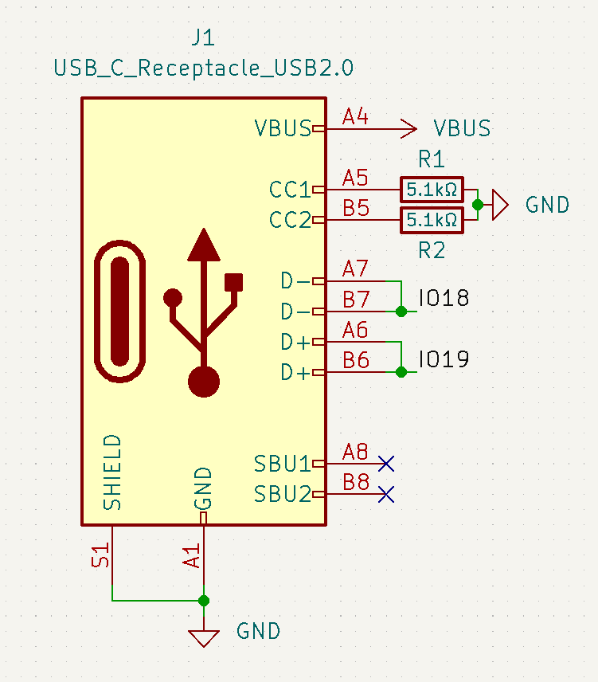
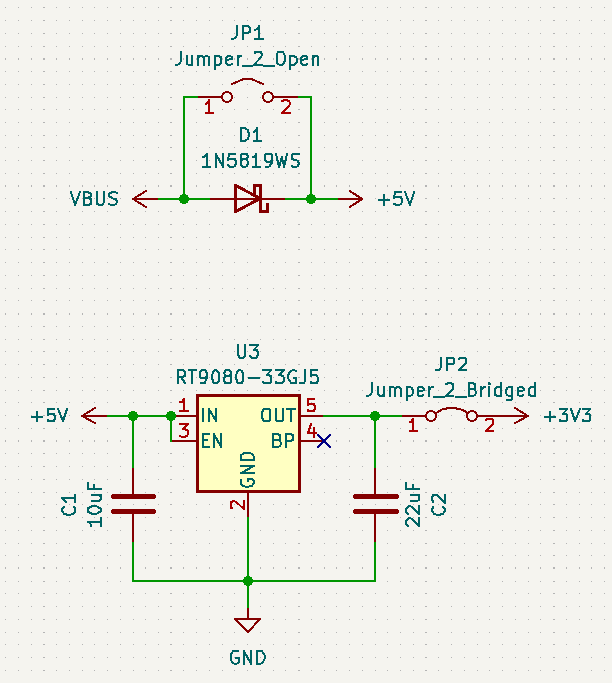
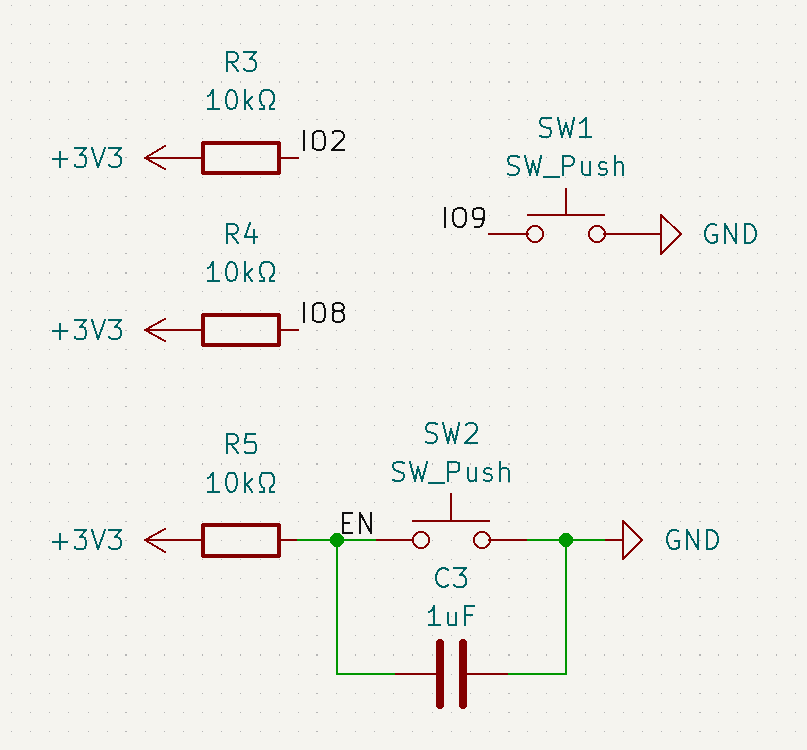
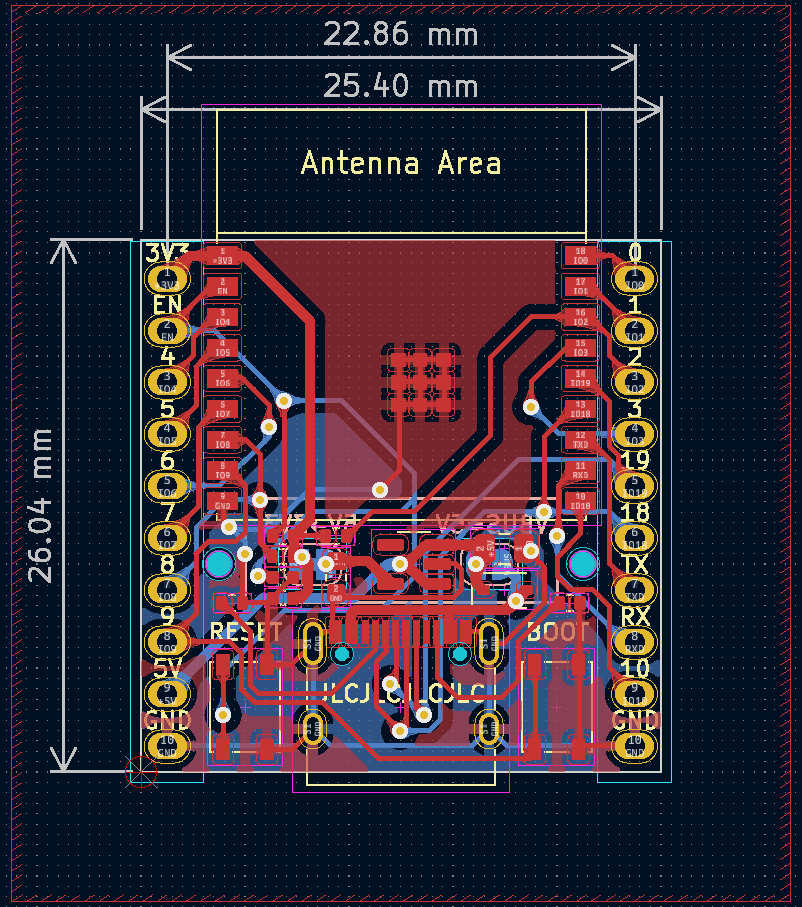
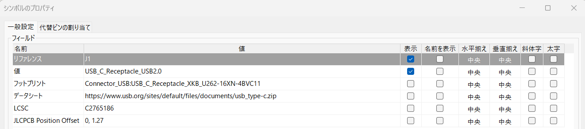
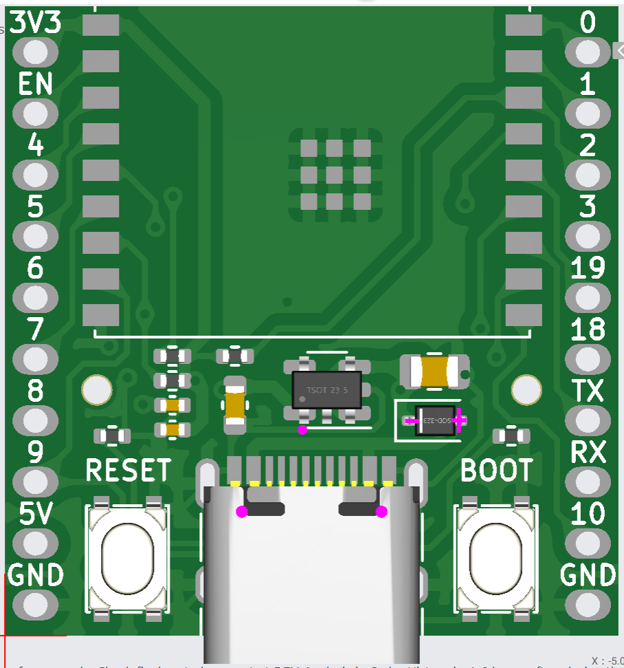
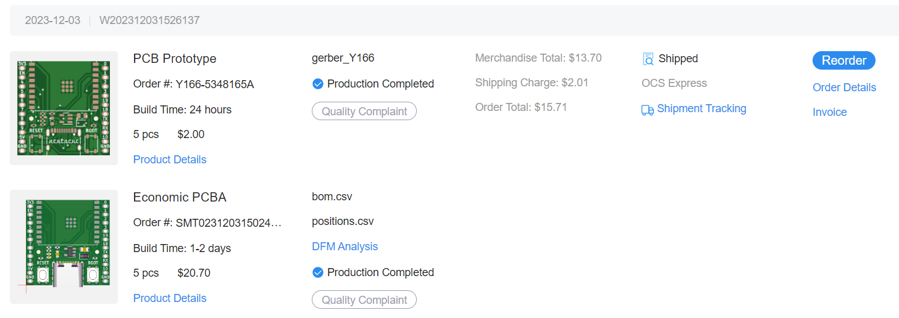

# ESP32-C3を使った超省電力マイコンボードの設計

## ESP32-C3とは？
ESP8266の後継版。主な違いとしては、

* RISC-Vプロセッサ（ESP32はXtensa）
* Bluetooth Classicの廃止
* 安い（秋月でWROOMが310円）←ここ重要
* 低消費電力
* USBシリアルの追加

と言ったところ。アンテナがモジュールに実装されているWROOM、MINIに関しては日本でも技適が通っているため誰でも利用可能。2023年現在では容易に入手できるようになった。Arduino IDEによる開発も可能。  
[ESP32-C3 Datasheet](https://www.espressif.com/sites/default/files/documentation/esp32-c3_datasheet_en.pdf)

## なぜESP32-C3を使うのか
マイコンボードの設計であれば、ESP32、ESP32-S3といった種類が存在するが、Deep-sleep時における消費電流が異なってくる。各チップの消費電流をまとめると次のようになる。（データシートを参照）

| ESP32 | ESP32-S3 | ESP32-C3 | 
| ----- | -------- | -------- | 
| 10µA  | 7µA      | 5µA      | 

上の図を見れば分かるように、ESP32-C3は他のシリーズと比較しても最小の電流値である。

また、USBシリアルが内蔵されていることからシリアル変換モジュールによる消費電流を勘案する必要が無い。

## 既存の開発ボードの問題点
ESP32-C3はEspressifにより開発ボードが既に公開されている。  
[ESP32-C3-DevKitC-02](https://docs.espressif.com/projects/esp-idf/en/latest/esp32c3/hw-reference/esp32c3/user-guide-devkitc-02.html)

じゃあ改めて作る必要ないじゃないか！と言いたいところだが、省電力マイコンとしてはやや弱い。この開発ボードではDeep-sleepにしても0.3mA程度も消費する。確かにこれでも低い電流値であるが、データシートでは5μAとなっているのでもっと最適化できるはずだ。このように既存の開発ボードでは消費電流が高くなってしまう要因としては、

* シリアル変換モジュール（CP2102）の消費電流 ... 200μA程度
* レギュレーター（SGM2212）の消費電流 ... 100μA程度

が挙げられる。これらの消費電流を抑えれば、消費電流を5μAに近づけられる。

## 部品選定
今回設計する開発ボードに用いる部品は、次のように決定した（抵抗、コンデンサなどは省略）。

* モジュール ... ESP32-C3-WROOM-02-N4
* レギュレータ ... RT9080-33GJ5
* USB ... Type-C
* ブートモード切替用スイッチ ... SKRPABE010

### モジュール
今回はESP32-C3-WROOM-02-N4を利用する。これははんだごてではんだ付けができるようにするのと、秋月電子で入手が可能であったため。リフローが可能であれば、ESP32-C3-MINI-1-N4を使った方が良い。

### レギュレータ
こちらは3.3Vの電源生成に必須。静止電流が低いレギュレータを選ぶ。静止電流とは、レギュレータに接続するだけで消費する電流である（厳密にいうとOUTとGND間での消費電流）。

レギュレータは以下の条件を満たすものを選んだ。

* 出力電圧が3.3V（当然）
* 静電電流が低いこと
* 最大放出電流が500mA以上（ESP32-C3のデータシートで決められている）
* それなりに容易に入手できること。生産終了品や、DigiKeyなどで入手できないようなものはNG

今回使用するレギュレータは次のようなものにした。  
[RT9080-33GJ5](https://www.digikey.jp/ja/products/detail/richtek-usa-inc/RT9080-33GJ5/6161634)

このレギュレータについてだが、以下のような特性を持つ。

* 最大入力電圧 ... 6.5V（推奨値は5.5V）
* 最大出力電流 ... 600mA
* 静止電流 ... 2 ~ 4μA

静止電流がかなり低い。また、最大出力電流も十分。ただし、最大入力電圧が低いので、高い電圧を入力しないように注意する必要がある。

### USB
最近よく使われるようになったType-Cを使う。Mircoと配線が少し変わるが、抵抗が2つ増えるだけなので、そこまで複雑にはならない。

### ブートモード切替用スイッチ
今回はSKRPABE010を使用する。押しやすくて他の部分でも良く使われているのでこれにした。

### シリアル変換モジュール
ESP32-C3-DevKitC-02では開発ボードにシリアル変換モジュールが存在するが、ESP32-C3は内蔵でシリアル変換を持っているので明らかに不要。ということでこれは外す。

### 抵抗、コンデンサなど
抵抗、コンデンサについては、値が正しく、定格電圧、定格電力が適切であればなんでも良い。ただし、JLCPCBに発注する場合は料金を抑えるため「Basic Parts」を優先的に選択すること。（後述）

## 基板設計
今回はKiCADで設計。昔は使い勝手が悪かったが、最近のKiCADはかなり使いやすく、ツールも多い。

各部構造は次の通り。

### USB
{ width="300" }

5.1kΩの終端抵抗をCCに追加する。これによってUSBから5Vの給電が可能となる。終端抵抗の詳細については以下を参照。  
[USB Type-Cに置き換える方法 第1話 Type-Cの原理を知る](https://emb.macnica.co.jp/articles/8968/)

D+、D-については、それぞれGPIO19, 18に直接結線すれば通信可能。

### マイコン供給電源生成
{ width="300" }

RT9080-33GJ5により入力電源を3.3Vに降下させる。また、外部電源とUSBの両方で給電した際、電圧差によるショートを防ぐため、ダイオードを設置した。  
なお、はんだジャンパを2つ実装している。ダイオード側のジャンパはダイオードによる電圧降下を防ぎたいときに繋ぎ、レギュレータ側のジャンパはレギュレータによる静電電流を発生させない場合に切断する（この場合は外部電源から供給できなくなるので、別途3.3Vの電源を用意する必要がある）。

### ブートモード設定
{ width="300" }

ESP32-C3は、起動時にGPIOの電圧を確認してブートモードを決定する。ブートモードの決定は次の表に従う。なお、GPIO9については、デフォルトでプルアップされている。

| Boot Mode | GPIO2 | GPIO8 | GPIO9 |
| ---- | ---- | ---- | ---- |
| SPI Boot | 1 | Any value | 1 |
| Download Boot | 1 | 1 | 0 |

つまり、GPIO2と8についてはプルアップし、GPIO9をタクトスイッチでLOWに変更できるようにすればよい。また、ENについてはプルアップし、スイッチを押したときにLOWとすることでリセットできるようにする。ブートモードの切り替え方をまとめると次のようになる。

* SPI Boot（通常のブート） ... ENのスイッチを押す
* Doanload Boot（ダウンロードブート） ... GPIO9のスイッチを押しながらENのスイッチを押す

ちなみに、USBシリアルではブートモードを自動で切り替えてくれるので基本的にはブートモードを切り替えなくて良い（ただし、初回書き込み時はフラッシュが0xffで埋め尽くされており、SPI Bootでは再起動を繰り返すため手動でブートモードを切り替える必要がある）。

???+ note
    GPIO18, 19をOUTPUTとして使うとPC側からUSBシリアルとして認識できなくなる。その場合も手動でブートモードを切り替える必要がある。また、GPIO18, 19はUSB意外と接続している間はUSBシリアルとして認識できないことに注意。

### ボード図
{ width="500" }

ボード図は上の図のようになった。信号の配線幅は0.25mm、電源の配線幅は0.5mmに設定した。基本的に配線幅については、最大電流に応じて設定する。最大電流が1Aの場合に配線幅を1mmを基準とすることが多い。

部品のフットプリントは全て表面に配置し、はんだジャンパは裏面に実装した。JLCPCBの場合、部品実装は片面のみ（Economic PCBAの場合）になるので、部品のフットプリントは全て一方の面に配置する必要がある。

また、基板は両面ベタGNDとし、ティアドロップを追加している（ツール→ティアドロップを追加から基板全体に追加可能）。気づいたらKiCADにもティアドロップ機能が実装されていた。

3Dモデルは次のようになった。  
{ width="400" }

## 基板発注
発注先は料金を考慮してJLCPCBにした。また、今回は部品実装も依頼している。

### 基板製造用の設定
JLCPCBでは部品番号の表示位置を設定することが可能（消すことも可能だが、0.5ドルの追加料金が発生する）。部品番号の表示位置を指定するには、表示したい場所にシルクスクリーン上で「JLCJLCJLCJLC」と入力すれば良い。今回はUSBの真下に部品番号を表示するように指定して見えなくした。  
参考：[How to remove order number from your PCB?](https://jlcpcb.com/help/article/50-How-to-remove-order-number-from-your-PCB)

また、PCBA（部品実装）では、基板マウント用の穴を実装する必要がある（省略すると、JLCPCBによって追加される）。具体的には、直径1.152mmで拡張マスクが0.148mmの穴を2つ実装する必要がある。詳細は以下を参照。  
参考：[How to add tooling holes for PCB assembly order](https://jlcpcb.com/help/article/47-How-to-add-tooling-holes-for-PCB-assembly-order)

### ガーバーファイル、BOM、CPLの出力
手動で出力するのも可能だが、面倒なのでJLC-Plugin-for-KiCadを利用した。プラグイン＆コンテンツマネージャから追加可能。追加後は、ボード図のところでプラグインを起動すればJLCPCBに提出するファイルが全て出力される。

[JLC-Plugin-for-KiCad](https://github.com/bennymeg/JLC-Plugin-for-KiCad)

また、部品実装にあたって、回路図上で、部品番号を指定する必要がある。設定するには、シンボルのプロパティにLCSCのプロパティを追加して値に部品番号を入力すればよい。

{ width="800" }

部品番号は[JLCPCB Assembly Parts Lib](https://jlcpcb.com/parts/)から検索することで取得可能。

### 部品実装のプレビューと位置の修正
{ width="400" }

JLCPCBにデータをアップロードすると、部品実装後の3Dモデルがプレビューされる。部品によってはKiCADのフットプリントとLCSCのフットプリントが一致しておらず、座標や角度がずれる。上の図では、USBの位置やレギュレータの角度がずれている。そのような場合は基準となる位置や角度の補正が必要。基準角を変更するにはシンボルのプロパティで「JLCPCB Rotation Offset」を、基準座標を変えるには「JLCPCB Position Offset」のパラメータを追加して変更すればよい。  
詳細については、JLC-Plugin-for-KiCadのリポジトリのREADMEに書いてあるので部品実装を依頼したい人は読んでみよう。

### PCBAの料金
PCBAでは以下の料金が追加される。

* Setup Fee, Stencil ... セットアップ料金とステンシル代。発注毎に発生する。Economic PCBAでは合わせて9.5ドルだが、PCBAでは毎月2回まで9ドルのクーポンを使えるため、実質的には0.5ドル程度。
* Components ... 部品代。発注個数に応じて料金が変わる。ちなみに抵抗やコンデンサなどは1個につき0~1円程度。
* Extend Parts fee ... Extend Parts（Basic Partではない部品）を実装する場合、1種類につき3ドルを請求される。かなり高いので基本的に抵抗やコンデンサはBasic Partsにしておきたい。
* SMT Assembly ... 1ジョイントあたり0.0017ドル。ほとんど気にならない。

Basic Partsの多くは抵抗、コンデンサといったものなので、これらの部品はBasic Partsを選択しておくと、費用を抑えられる。

JLCPCBのPCBAは部品代が恐ろしく安いので、自分で部品を手配するよりは安く済む。あまり使っている人は多くない印象があるので積極的に使ってみてほしい。

### 発送オプション
安いものを選ぼう。DHLだと少し早くなるが、せっかちでなければ送料の安いOCSの方が良いだろう。

### 発注の様子
{ width="800" }

今回は試作なので5枚のみの発注。ESP32-C3-WROOM-02のモジュールについては、そもそもEconomic PCBAでは実装してくれないので、自分ではんだ付けすることにした。

1枚当たり約400円くらいとなった。ちなみに50枚だと送料込みで48ドルくらいなので結構単価当たりの料金は下がる。

## 検証

発注から約2週間後、部品実装済みの基板が到着したので、早速消費電流を測定してみる。5Vに外部電源を入れて電流計で消費電流を測定してみた。

Deep-sleepを実行中の消費電流は7μAであり、理論通りの結果が得られた。

## リポジトリ
基板のプロジェクトはここにまとめました。必要に応じて自由に使ってください。  
[ESP32-C3-DevBoard](https://github.com/21km43/ESP32-C3-DevBoard)
