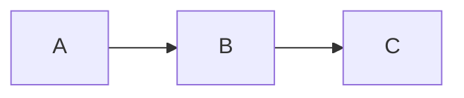

--- 
hide_table_of_contents: true
---

# Documents



:::note
Some **content** with _Markdown_ `syntax`. Check [this `api`](#).
:::

$$
I = \int_0^{2\pi} \sin(x)\,dx
$$

<details><summary>CLICK ME</summary>

#### yes, even hidden code blocks!
```python
print("hello world!")
```
</details>

https://qiita.com/Qiita/items/c686397e4a0f4f11683d

[url sample](tutorial-basics/congratulations.md)
